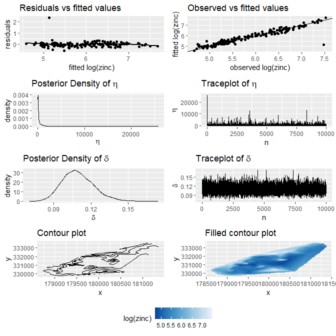

<!-- README.md is generated from README.Rmd. Please edit that file -->

# DSSP

<!-- badges: start -->

[](https://github.com/gentrywhite/DSSP/actions)

<!-- badges: end -->

The goal of DSSP is to draw samples from the direct sampling spatial
prior model (DSSP) described in White et. al. 2019. The basic model
assumes a Gaussian likelihood and derives a spatial prior based on
thin-plate splines. Functions are included so that the model can be
extended to be used for generalised linear mixed models or Bayesian
Hierarchical Models.

## Installation

You can install the development version from
[GitHub](https://github.com/) with:

``` r
# install.packages("devtools")
devtools::install_github("gentrywhite/DSSP")
```

## Example

Short example using the Meuse dataset from the `{gstat}` package.

``` r
data("meuse.all", package = "gstat")
meuse.train <- meuse.all[1:155, ]
meuse.valid <- meuse.all[156:164, c("x", "y")]
sp::coordinates(meuse.train) <- ~ x + y
sp::coordinates(meuse.valid) <- ~ x + y
```

This model does not include any covariates.

``` r
library(DSSP)
meuse.fit <- DSSP(
  formula = log(zinc) ~ 1, data = meuse.train, N = 10000,
  pars = c(0.001, 0.001), log_prior = function(x) -2 * log(1 + x)
)
```

The fitted values are close to the actual values.

``` r
library(ggplot2)
Yhat <- rowMeans(exp(meuse.fit$y_fitted))
Ytrue <- meuse.all$zinc[1:155]

data.frame(Yhat = Yhat, Ytrue = Ytrue) |>
  ggplot(aes(x = Yhat, y = Ytrue)) +
  geom_point(size = 3) +
  geom_abline(aes(intercept = 0, slope = 1)) +
  labs(x = "Smoothed Values", y = "Observed Values", title = "Smoothed vs. Observed Values") +
  theme(plot.title = element_text(hjust = 0.5)) +
  theme_bw()
```



## Introduction

The Direct Sampling Spatial Prior (DSSP) is based on the thin-plate
splines solution to the smoothing problem of minimising the penalised
sum of squares

 = \frac{1}{n}\sum^{n}_{i}W_i(y_i - f(\mathbf{x}_i))^2
+\eta J_m(f)
")

which can be written as

'\mathbf{W}(\mathbf{y}-\mathbf{\nu})+
\eta\mathbf{\nu}'\mathbf{M}\mathbf{\nu}.
")

The solution for this problem is

^{-1}\mathbf{y}.
")

If we assume that the observed data are from a Gaussian distribution


")

and if we specify the prior for


![
\\left\[\\mathbf{\\nu}\\mid\\eta,\\delta\\right\]\\propto\\ \\frac{\\eta}{\\delta}^{-{r}/2}
\\exp\\left(-\\frac{\\eta}{2\\delta}\\mathbf{\\nu}'\\mathbf{M}\\mathbf{\\nu}\\right),
](https://latex.codecogs.com/png.image?%5Cdpi%7B110%7D&space;%5Cbg_white&space;%0A%5Cleft%5B%5Cmathbf%7B%5Cnu%7D%5Cmid%5Ceta%2C%5Cdelta%5Cright%5D%5Cpropto%5C%20%5Cfrac%7B%5Ceta%7D%7B%5Cdelta%7D%5E%7B-%7Br%7D%2F2%7D%0A%5Cexp%5Cleft%28-%5Cfrac%7B%5Ceta%7D%7B2%5Cdelta%7D%5Cmathbf%7B%5Cnu%7D%27%5Cmathbf%7BM%7D%5Cmathbf%7B%5Cnu%7D%5Cright%29%2C%0A "
\left[\mathbf{\nu}\mid\eta,\delta\right]\propto\ \frac{\eta}{\delta}^{-{r}/2}
\exp\left(-\frac{\eta}{2\delta}\mathbf{\nu}'\mathbf{M}\mathbf{\nu}\right),
")

the resulting posterior of

is proportional to

'\mathbf{W}({\mathbf{y}}-\mathbf{\nu})
-\eta\mathbf{\nu}'\mathbf{M}\mathbf{\nu}\right)
")

which yields the posterior mean with the same solution as the penalised
least squares.

The complete model is specified with a Gaussian likelihood, the improper
prior for
,
an inverse gaussian prior for
,
and a prior for
.
With this specification the joint posterior is written

\propto
f(\mathbf{y}|\mathbf{\nu},\delta)\pi\left(\mathbf{\nu}|\eta,\delta\right)\pi\left(\delta\right)
\pi\left(\eta\right).
")

Given this it is possible to derive the set of posterior distributions

\\")

\\")

")

which can be sampled directly in sequence to create a draw from the
joint posterior

.
")

This is the heart of what the function `DSSP()` does[^1].

[^1]: see G. White, D. Sun, P. Speckman (2019) \<arXiv:1906.05575\> for
    details
